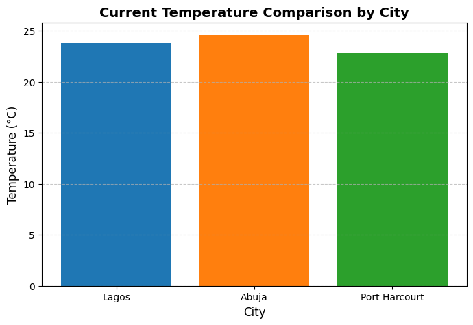
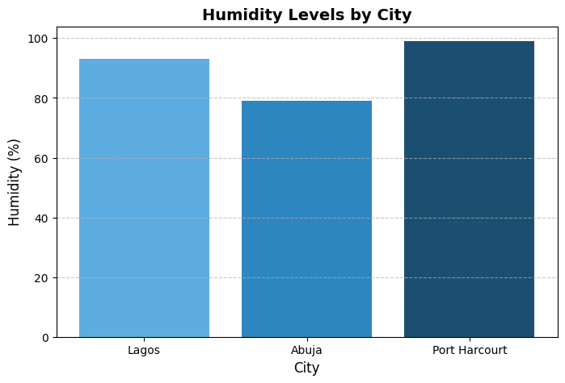
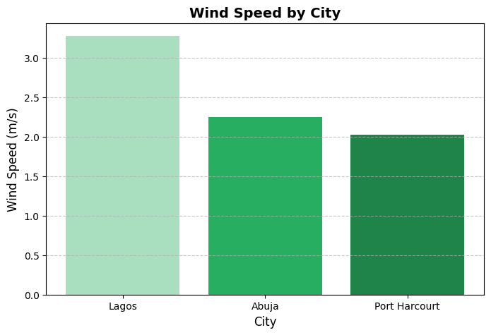

## AnalystLab Week 7 Internship Project: Weather Data Pipeline

An automated, end-to-end Python pipeline that extracts real-time weather metrics from three major Nigerian urban hubs (Lagos, Abuja, and Port Harcourt) via the OpenWeatherMap API, transforms the data for analytical readiness, and exports the finalized dataset.

A lightweight, end-to-end ETL (Extract, Transform, Load) pipeline that pulls live weather data for Nigerian cities from the OpenWeather API, cleans and structures it with Pandas, exports it to CSV, and visualizes key metrics with Matplotlib.

Built in Google Colab as a hands-on data engineering / data analysis exercise.

## Project Overview

This project automates the process of collecting real-time weather data and turning it into a clean, analysis-ready dataset. It covers the three core stages of a data pipeline:

Extract — Fetch live weather data from the OpenWeather API for a list of cities.
Transform — Parse the JSON responses, structure them into a Pandas DataFrame, rename columns, convert data types, and check for missing values.
Load — Export the final clean dataset to a CSV file and generate summary statistics and visualizations.

## Cities tracked: Lagos, Abuja, Port Harcourt

## Tech Stack

Python 3
Pandas — data structuring and cleaning
Requests — API calls
Matplotlib — data visualization
OpenWeather API — live weather data source
Google Colab — development environment

## Pipeline Steps

Define the list of target cities.
Loop through each city and call the OpenWeather API to fetch current conditions.
Extract key fields from the JSON response: city name, temperature, humidity, weather condition, wind speed, and timestamp.
Load the extracted records into a Pandas DataFrame.
Rename columns for clarity and consistency.
Convert the timestamp column to a proper datetime type and check for missing values.
Export the cleaned DataFrame to weather_data.csv.
Generate summary statistics (mean, min, max, etc.) and identify the warmest city.
Visualize temperature, humidity, and wind speed across cities using bar charts.

📊 Sample Output

## Temperature Comparison

## Humidity Levels

## Wind Speed

## Weather Analysis & Insights

# Data captured on July 17, 2026, at 11:05 AM

1. Temperature Variation
Abuja recorded the warmest reading at 24.61°C, Lagos sat in the middle at 23.82°C, and Port Harcourt was the coolest at 22.84°C, influenced by active regional rain.

2. Extreme Humidity Trends
Port Harcourt registered a near-saturated 99% humidity due to active rain, Lagos followed at 93% (also experiencing rain), and inland Abuja trailed at 79%. The average humidity across the three cities was a notably damp 90.33%.

3. Wind Speed & Air Circulation
Lagos had the strongest winds at 3.28 m/s (coastal breeze), Abuja was moderate at 2.25 m/s, and Port Harcourt was the calmest at 2.03 m/s.

## Project Structure

weather-etl-pipeline/
├── Weather_ETL_Pipeline.ipynb   # Main notebook (extract, transform, load, visualize)
├── weather_data.csv             # Output dataset (generated on run)
├── temperature_chart.png        # Temperature comparison chart
├── humidity_chart.png           # Humidity comparison chart
├── windspeed_chart.png          # Wind speed comparison chart
└── README.md

## Security Note

The current notebook has the OpenWeather API key hardcoded directly in a cell. Before pushing this repo publicly, remove the hardcoded key, rotate it on your OpenWeather account, and switch to the environment-variable approach shown above so the key isn't exposed in your commit history.

## Conclusion

This project demonstrates how an automated ETL pipeline bridges the gap between raw data collection and practical analysis. By pulling live metrics from the OpenWeather API, structuring the JSON responses into a clean Pandas DataFrame, and exporting the final table to CSV, the pipeline delivers a simple, reproducible workflow for real-time weather monitoring.

The live data also surfaced a clear pattern in Nigeria's microclimates: coastal cities like Lagos and Port Harcourt showed intense moisture saturation — Port Harcourt reaching an extreme 99% humidity amid active rainfall — while inland Abuja stayed warmer and noticeably drier at 79% humidity. Capturing these variations in a repeatable, automated way highlights the broader value of ETL pipelines: they turn one-off snapshots into a reliable foundation for tracking short-term atmospheric shifts and, over time, building toward longer-term climate trend analysis.
